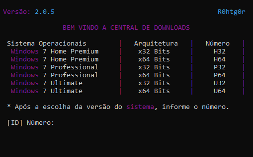

# Microsoft Console
</img>

# Descrição
A versão 1.0.0 está disponível dentro da pasta (models/openSource).
Essa aplicação foi desenvolvida no intuito de ajuda-los, baixar as versões do Windows 7 original, vindo direto dos servidores da Microsoft.

# Registro de Atualizações:
2.0.5
  * Adicionado layout de pastas para organizar o material.
  * Adicionado a função de pausar o download.
  * Adicionado histórico de atividade(models/connections).
  * Removido alguns bugs.
  * Console refeito(melhorado).
  * Código fonte refeito(melhorado).
  
1.0.0
  * Não disponível
